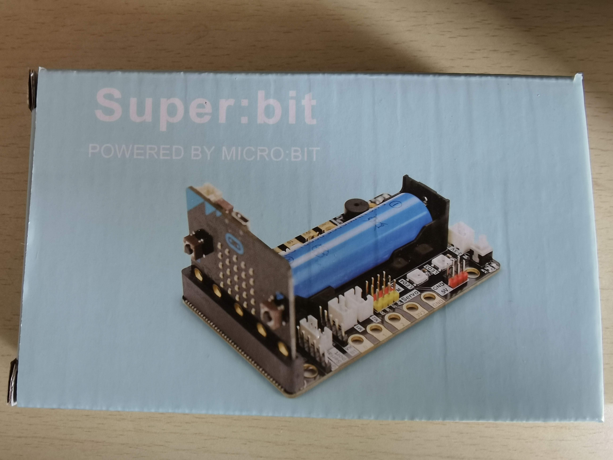
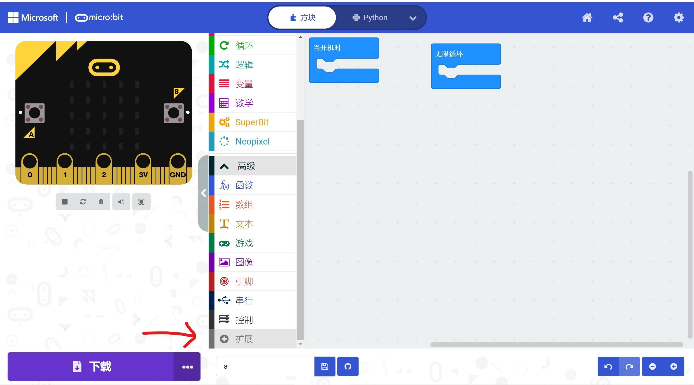
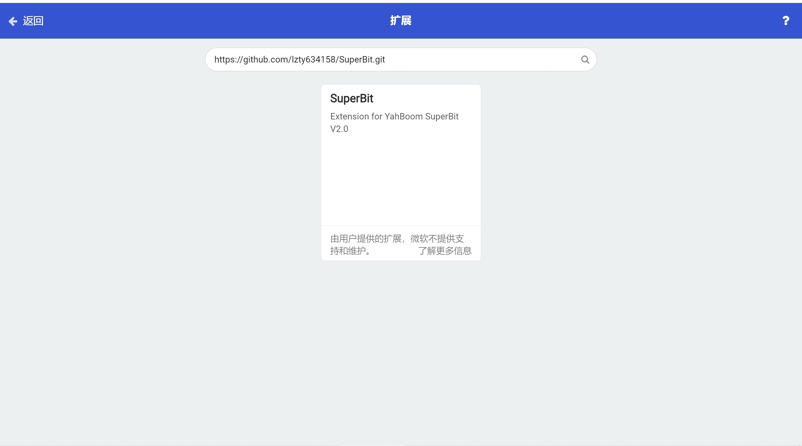
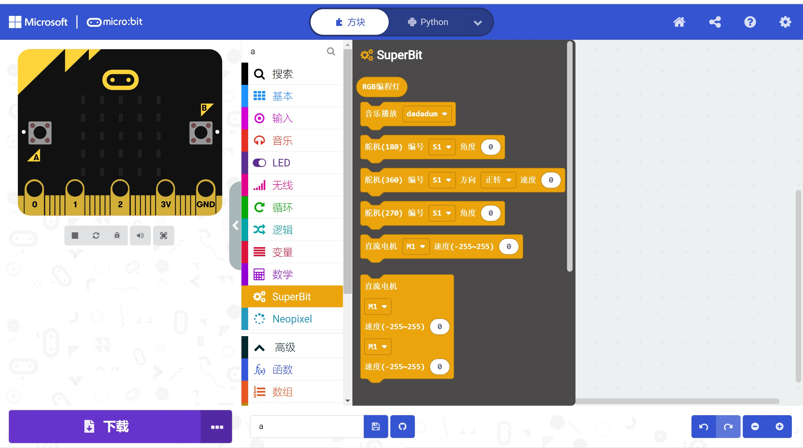
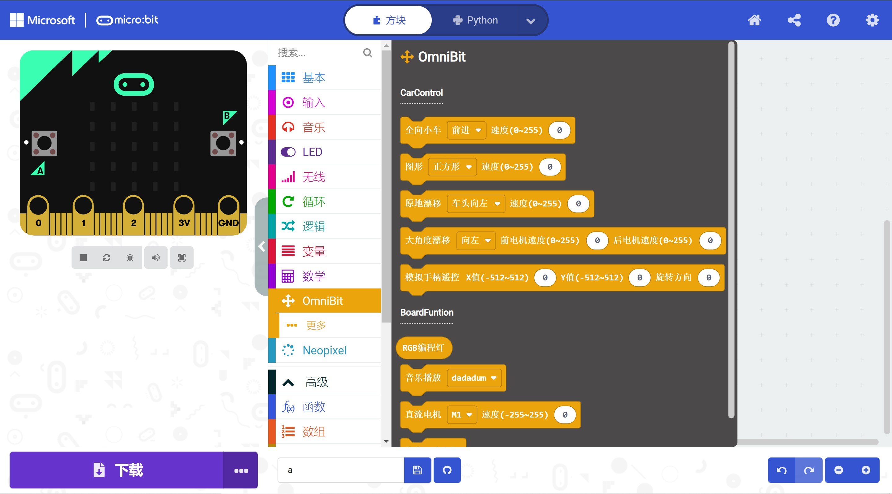

# micro:bit_mecanum_wheel_car
## 从零开始搭建一个属于自己的麦克纳姆轮小车

购买Yahboom公司的micro:bit扩展板SuperBit

在micro:bit官方网站 https://makecode.microbit.org/#editor 里下载扩展

扩展的网址 https://github.com/lzty634158/SuperBit.git 搜索并下载

我们现在就可以使用扩展板上M1-M4的接口了

当然，想偷懒的也可以下载另一个扩展，网址 https://github.com/lzty634158/OmniBit.git

但事实上，你买到的四个电机转速不能保证完全一样，所以还是建议使用第一个扩展，进行电机速度微调，保证四个电机速度基本一致，让你的小车走起来更稳

还有一点值得注意的是，这两个扩展时不兼容的，二者一起使用会导致编译错误

## 遥控的程序有两个，下载了superbit扩展的请使用superbitRemoteControl.py，下载了ominbit的请使用omnibit.py

# 缓慢更新中
