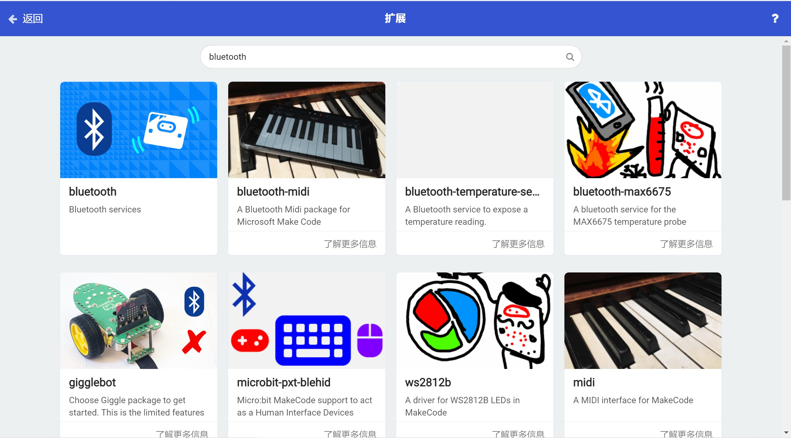
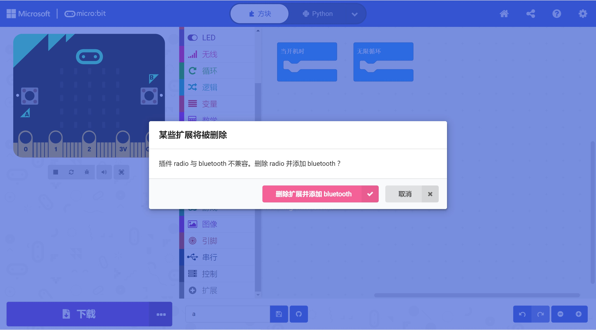
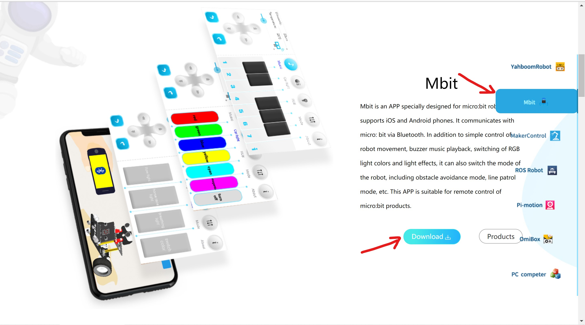
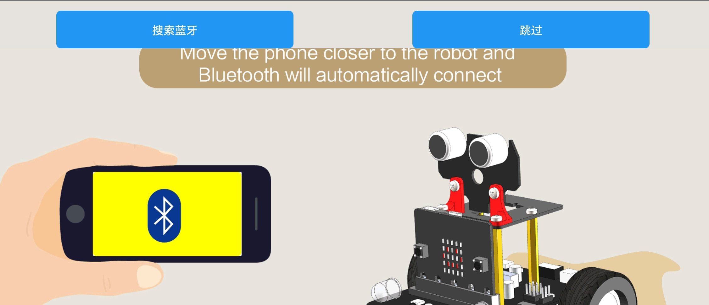
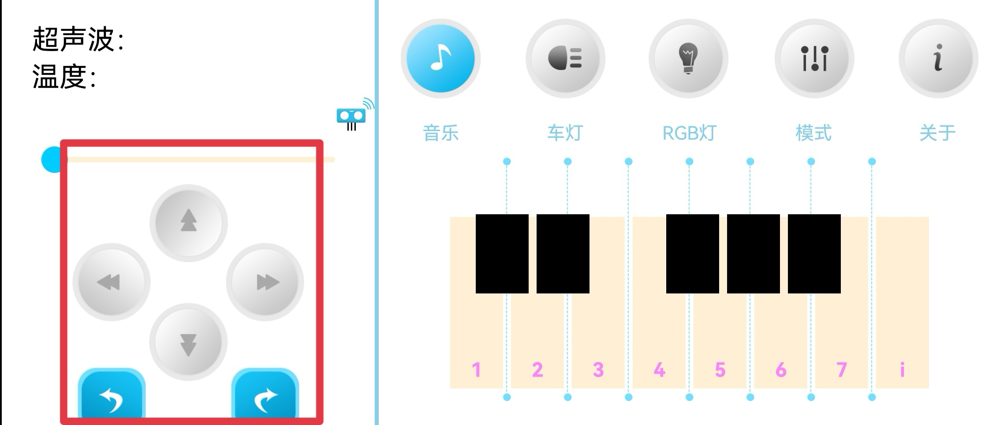

# micro:bit_mecanum_wheel_car
## 从零开始搭建一个属于自己的麦克纳姆轮小车

购买Yahboom公司的micro:bit扩展板SuperBit

在micro:bit官方网站 https://makecode.microbit.org/#editor 里下载扩展

扩展的网址 https://github.com/lzty634158/SuperBit.git 搜索并下载

我们现在就可以使用扩展板上M1-M4的接口了

当然，想偷懒的也可以下载另一个扩展，网址 https://github.com/lzty634158/OmniBit.git

但事实上，你买到的四个电机转速不能保证完全一样，所以还是建议使用第一个扩展，进行电机速度微调，保证四个电机速度基本一致，让你的小车走起来更稳

还有一点值得注意的是，这两个扩展是不兼容的，二者一起使用会导致编译错误

下载完这两个扩展之后，还需要下载一个蓝牙扩展

直接搜索bluetooth，第一个就是，然后他会提示你删除radio，那么按他说的来，因为microbit无线通信和蓝牙通信只能二选一

## 这些都安好了之后，你就可以复制我的代码了。遥控的程序有两个，下载了superbit扩展的请使用superbitRemoteControl.py，下载了ominbit的请使用omnibitRemoteControl.py

### 接下来是下载遥控的app

网址 http://www.yahboom.net/software/app

找到第二个即mbit，点击download就行了，根据你的手机是安卓还是ios来下载

#### 打开你的手机定位和蓝牙，记住是同时都打开！随后同时按下你的microbit上的A，B键，然后按下背板上的重置键随后松开（此时AB键不能放开），等待显示屏上出现蓝牙符号后即可放开AB键，在你的蓝牙设置里就可以找到microbit，请点击配对（可能要点击两次）

配对完成后请打开app，点击app上的搜索蓝牙，成功后你就可以进入操作页面

点击红方框内的六个按键就可以让你的小车动起来啦

# 缓慢更新中
